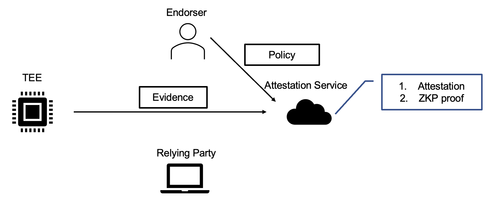
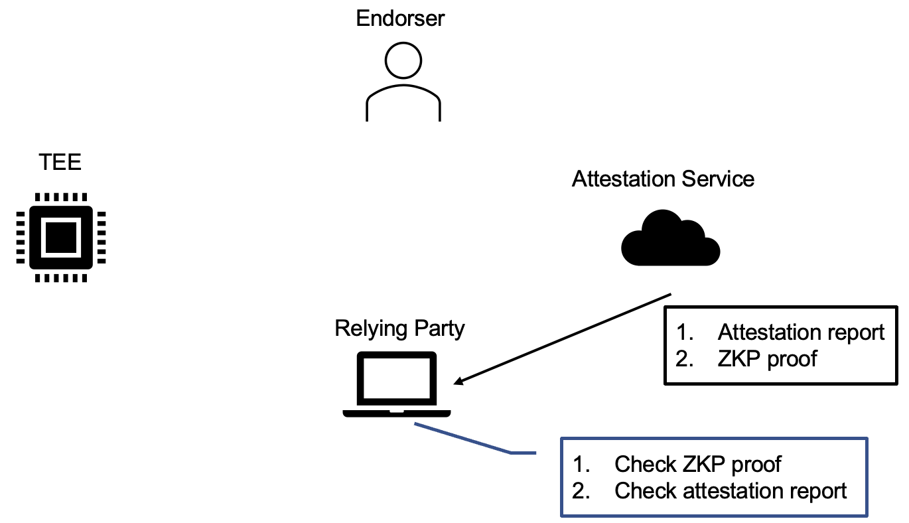

# Trustless Attestation Verification (Circom)

This project contains an implementation of trustless attestation verification  based on Circom, it automates the end-to-end process of compiling Circom circuits, generating witnesses and proofs, and verifying proofs using a Makefile. For more details about the background and problem setting, please visit our [main repository](https://github.com/tiktok-privacy-innovation/trustless-attestation-verification).

## Prerequisites

| Required dependency                                                            | Tested version | Use                               |
|--------------------------------------------------------------------------------|----------------|-----------------------------------|
| [Node](https://nodejs.org/en/download/package-manager/all)                                    | 22.9.0        | Run snarkjs       |
| [Rust](https://www.rust-lang.org/tools/install)                                     | 1.81.0          | CLI and input generation       |
| [Circom](https://docs.circom.io/getting-started/installation/)                                     | 2.1.9          | Circuit Compilation      |
| [snarkjs](https://docs.circom.io/getting-started/installation/)       | latest          | ZKP backend           |

### Docker Environment
To provide a stable execution environment, we also provide a Docker image with all the prerequisites installed. You can use docker compose up to build and run the Docker containers.

Build the Docker containers:

```sh
docker buildx build -t [your-image-name] .
```

This command will build the Docker image with all the necessary tools and dependencies.

### Accessing the Container

Start the docker containers with the following command:

```sh
docker run --rm -it -v ./:/app [your-image-name]
```
This command also mounts the current folder into the docker container, so that you can find relative files in `/app`.

## Getting Started

We have provided a Makefile to help you swiftly execute the setup, compilation, proof generation, and proof verification processes.

### Prerequisites
1. Input files: Place prepare your input files:

- vcek.pem (the VCEK certificate)
- report.bin (the attestation report, as of now, we only support AMD)

If you clone our main repo, and then clone this project under the root directory of the main repo, the default directory of the input files should be `../samples`, you can also change it as the example below:
```sh
make prepare_input INPUT_DIR={your inputs dir}
```

2. Clone the repository: Clone the repository with the following command:

```sh
git clone https://github.com/tiktok-privacy-innovation/trustless-attestation-verification-circom/
cd trustless-attestation-verification-circom
```

### Steps

0. Pull and initiate submodules

This command will pull all the required submodules and set them up.
```sh
make prepare
```


1. Launch Trusted Setup

Run the following command to initiate the trusted setup:

```sh
make trusted_setup
```

This generates a .ptau file containing the common reference string required by ZK-SNARK. Please note that this process can be time-consuming (approximately 1.5 hours based on our tests).

2. Compile Circuits

Next, compile the circuits:

```sh
make compile_circuits
```

This command will:

- compile the circuits and generate the circuit related files in `build/{circuit-name}-circuit` directory.
- generate corresponding proving keys and verification keys.

3. Prepare Input

Convert the attestation report and certificates into the format required by ZK-SNARK:

```sh
make prepare_input
```

4. Generate Proofs

Generate witnesses and the corresponding proofs on behalf of the attestation service.
```sh
make generate_witness
make generate_proofs
```

5. Verify Proofs

The relying party can verify the proofs to confirm that the attestation procedure was performed as expected:

```sh
make verify_proofs
```

## General Flow of the Protocol
We introduce how attestation verification works with ZKP below:

## Trusted Setup

In the trusted setup phase, we require multiple parties to collaboratively setup the public parameters for the zero-knowledge proof system. It will be ideal if the parties involves neutral third parties and multiple hardware vendors to guarantee that sufficient portion of the parties executes the setup as expected.

This parties are also responsible for designing and auditing attestation circuits, and the trusted setup phase will translate the circuits into public key pairs (proving key, verification key). The proving keys will be distributed to the attestation server, and the verification keys will be distributed to the relying parties.

This corresponds to the the step 1 and step 2 in our implementation.

<figure style="text-align: center;">
  
  <figcaption>Figure 1: Trusted Setup</figcaption>
</figure>

## Proof Generation

TEE collects necessary information as the evidence, and sends it to the attestation server. Meanwhile, the hardware vendor could also set some costomized policy for specific hardware. This policy is embeded in the circuit during the circuit generation as well.

The attestation server then executes the attestation circuit, and generates two outputs: (1) the attestation report, and (2) ZKP proof confirming that the attestation server correctly executes the attestation circuit. The attestation server sends both outputs to the relying party.

This corresponds to the step 3 and step 4 in our implementation. Step 3 translate the evidence into the format compatible with ZKP snarkjs engine. Step 4 generates the witnesses and the proofs.

<figure style="text-align: center;">
  
  <figcaption>Figure 2: Proof Generation</figcaption>
</figure>

## Proof verification
After collecting the attestation report and the ZKP proof. Relying party first check the ZKP proof with the corresponding verification key. If the verification fails, it means the attestation service is malfunctioning. Otherwise, relying party checks the attestation report as usual.


<figure style="text-align: center;">
  
  <figcaption>Figure 3: Proof Verification</figcaption>
</figure>
